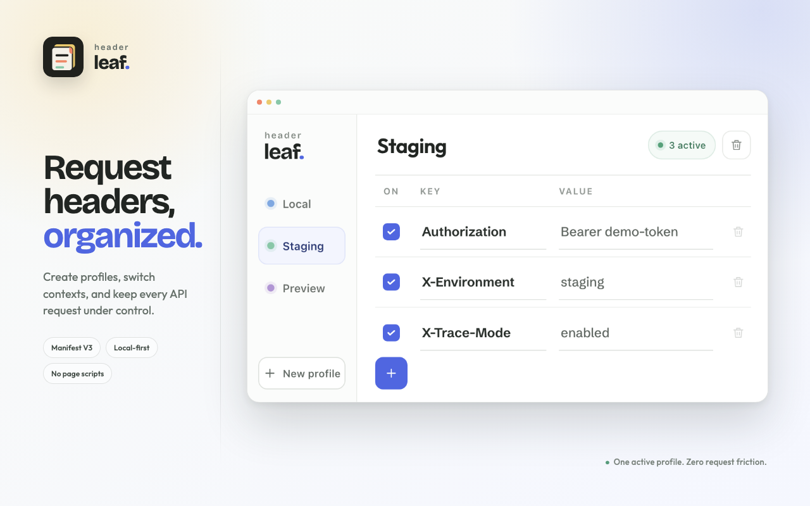

<p align="center">
  
</p>

<h1 align="center">Headerleaf</h1>

<p align="center">
  A compact, profile-based request header switcher for Chrome.
</p>

<p align="center">
  <strong>Manifest V3</strong> · <strong>Local-first</strong> · <strong>No injected page scripts</strong>
</p>



## What it does

Headerleaf keeps request headers in named profiles. Select a profile, enable the rows you need, and its headers are applied to new browser requests immediately.

- Create and rename multiple profiles
- Switch the active profile with one click
- Add, edit, enable, disable, and delete header rows
- Apply headers to fetch, XHR, navigation, scripts, images, WebSockets, and other request types
- Show the active header count on the toolbar icon
- Store configuration locally in `chrome.storage.local`
- Modify requests through the native Manifest V3 `declarativeNetRequest` API

Only the selected profile is active. Repeated header keys are de-duplicated, with the last enabled value winning.

## Install locally

```bash
pnpm install
pnpm build
```

Then:

1. Open `chrome://extensions`.
2. Enable **Developer mode**.
3. Click **Load unpacked**.
4. Select `dist/chrome-mv3/`.

After rebuilding, click the extension's refresh button on `chrome://extensions`.

## Usage

1. Select or create a profile in the left rail.
2. Add a header with the blue `+` button.
3. Enter the header key and value.
4. Use the checkbox to control whether that row is applied.
5. Trigger a new request in the target tab.

Header names may appear lowercased in Chrome DevTools. For example, `X-Debug-Mode` can be displayed as `x-debug-mode`.

## Permissions

| Permission | Why it is needed |
| --- | --- |
| `storage` | Persists profiles and header rows locally. |
| `declarativeNetRequestWithHostAccess` | Installs dynamic request-header modification rules. |
| `<all_urls>` | Allows enabled headers to apply to requests across sites. |

Headerleaf does not send profile data to a server, inject scripts into pages, or include analytics.

## Browser limitations

Chrome restricts modification of certain request headers. Headers such as `Host`, `Content-Length`, `Connection`, `Sec-*`, and some `Origin` values may be rejected or controlled by the browser. Use a custom header such as `X-Debug-Mode` when validating an installation.

Rules apply to newly issued requests. Refresh the target page or repeat the request after changing a profile.

## Development

```bash
pnpm dev       # Start WXT with an isolated Chrome profile
pnpm compile   # Type-check the project
pnpm build     # Build the unpacked Chrome extension
pnpm zip       # Build a Chrome Web Store zip
```

The project uses:

- [WXT](https://wxt.dev/) for extension tooling
- React and TypeScript for the popup
- Chrome Manifest V3 dynamic rules for request modification

## Store assets

| Asset | Size |
| --- | ---: |
| [Chrome Web Store screenshot](docs/images/chrome-web-store-1280x800.png) | 1280×800 |
| [Raw popup screenshot](docs/images/headerleaf-popup.png) | 1160×640 |
| [Extension icon](docs/images/headerleaf-icon-128.png) | 128×128 |

The source layout used to render the store screenshot is kept in [docs/store-screenshot.html](docs/store-screenshot.html).

## License

[MIT](LICENSE)

## Privacy

[Privacy Policy](PRIVACY.md)
